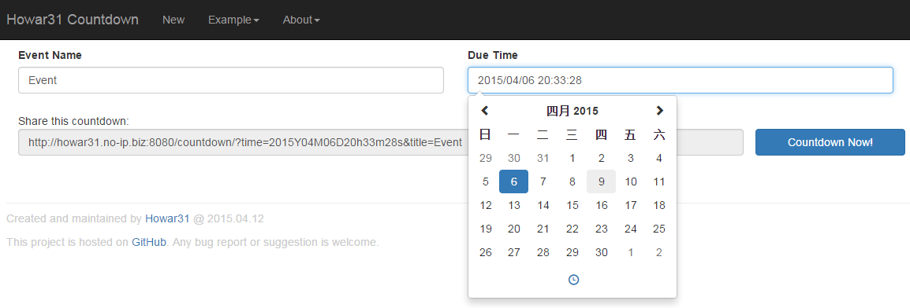

# Howar31 Countdown #
*A pure JavaScript Countdown timer.*

[http://howar31.com/countdown/](http://howar31.com/countdown/)

-

This countdown timer featuring pure client-side implementation with only HTML, CSS and JavaScript.  Thus, the Countdown timer will not store or access any private data of the countdown info.

> Feature
> * Pure JavaScript, all code running on local client.
> * Sharable countdown link, easy to share or save your countdown event with URL.
> * Neat and clean design with Bootstrap.
> * Responsive Web Design，powered by bootstrap to fit mobile and desktop devices.
> * Open source, this project is hosted on [GitHub](https://github.com/howar31/countdown)

> Usage
> * On the create new page
>   * Click "New" on navbar can create a new countdown event.
>     * Event Name: Input the title or description of this countdown event.
>     * Due Time: Use the datetime picker to select a date and a time.  Future or pass timestamp are all acceptable.
>   * After finished 2 fields above, the countdown link will automatically generated in "Share this countdown"
>     * You can click on the link to select and copy the URL.
>     * Or you can click "Countdown Now!" button to go to the webpage of the countdown event you just created.
> * On the countdown page
>   * The event name is show on top.
>   * The second row showing the event due time and current time.
>   * The countdown timer is showing in the middle.
>     * Empty date field (0) will be dim.
>     * If the due time passed, there will be a "Passed!" mark on the timer.
>   * You may click the "Share this countdown" field to select and copy the current timer URL.

Feel free to create issue on GitHub.  Any suggestion or bug report are welcome.
